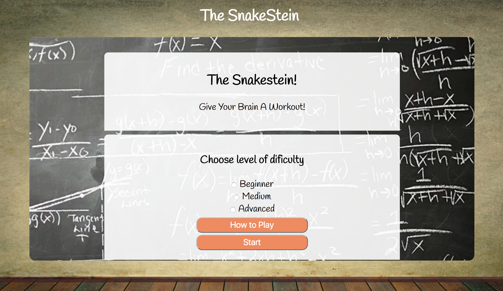

<h1> COLLECT SOME STUFF </H1>

<h3> HOW TO INSTALL THE GAME</h3>

- Download or clone the repo
- `npm i` to install dependencies
- `gulp` to compile the source code and open in browser

> **Note**: You'll need to have `gulp-cli` installed globally `npm i -g gulp-cli`

<h3> HOW THE GAME WORKS </H3>
<strong>The SnakeStein</strong> is a Math[:)] based game with a different operation to perform on each level.

<h3> Intro </H3>
You will have to chose between 3 difficulty levels, each of them making the game more difficult to pass trough Levels .
You can eighter start the game or read the "How to play" button!

<h3> Gameplay </H3>
When starting the game you will be given 5 seconds of empty board after which a series of numbers will randomly appear on the board from which you will have to get a specific one.

The numbers on the board will change possiton every 5 seconds making it more difficult for the player to get the correct number in time.

<h3> CHALLANGES </H3>
The main challenge I encountered during the creation of this game was making the snake move inside the grid without using an animation library.
I decided to use a class manipulation system witch it turned out to be very efficient and simple to use.

<h3> IMPROVEMENTS </h3>

At the moment the game has only 2 levels(addition and multiplying) so i would like to add at leas 3 more (subtraction, division and The Fibonacci sequence as the last level).
adding more features like a pause button and more animations to it.

### Software languages used-

* HTML 5
* SCSS
* Javascript ES6
* Jquery
* Gulp
* Git & Git Hub
